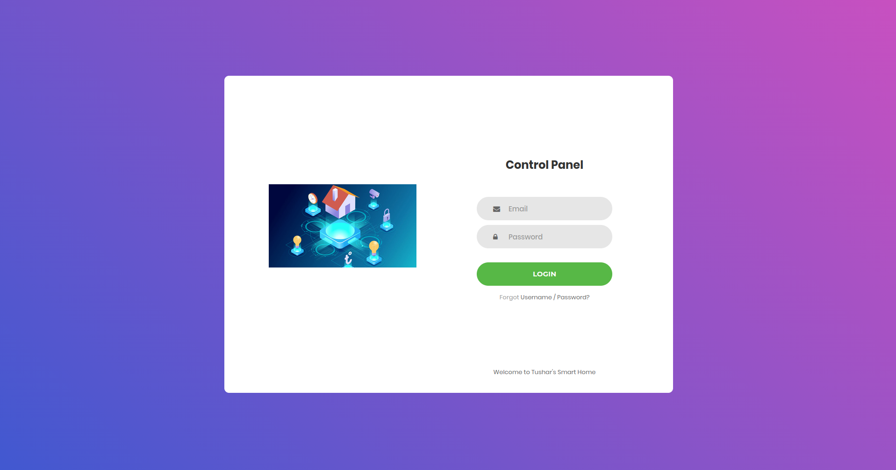
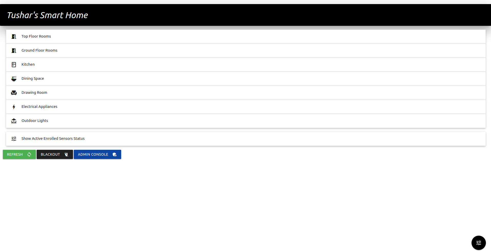
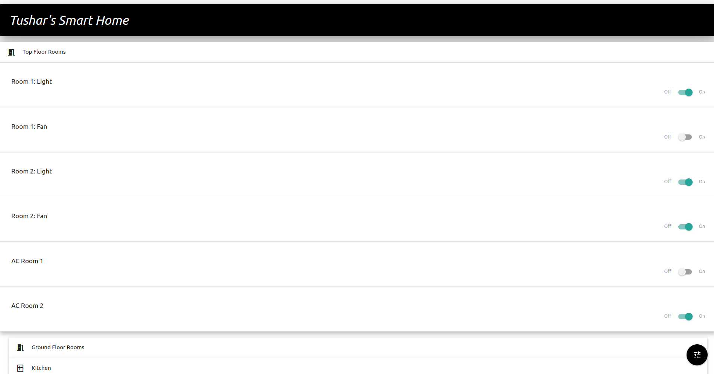

### [SmartHomeS](https://smarthomes.tkrsh.com/)

A full stack webapp for smart home integration based on django framework 3.0

Api to communicate with edge IOT Devices like Arduino, RaspPi for complete home automation

## For Demo Login ->

Usernmae -> demo@demo.com
password -> demo1234

[API For edge devices](https://smarthomes.tkrsh.com/out)

## Upcoming Features

    - Multiple Lighting modes
    - Arduino Sketch and configs

 
